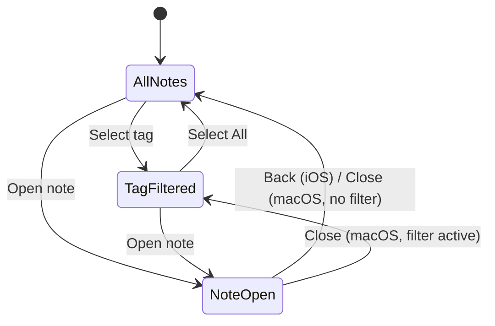

# MDE — Product & Functional Specification

> **Status:** Draft v1.0  
> **Last updated:** 2026-07-02  
> **Companion:** [HLD](./hld.md) (architecture) · [Docs index](./README.md)

---

## Contents

1. [Purpose & conventions](#1-purpose--conventions)
2. [Vision](#2-vision)
3. [Users & use cases](#3-users--use-cases)
4. [Platform & scope](#4-platform--scope)
5. [Syntax & content model](#5-syntax--content-model)
6. [Document & vault model](#6-document--vault-model)
7. [Functional requirements](#7-functional-requirements)
8. [Non-functional requirements](#8-non-functional-requirements)
9. [Data model summary](#9-data-model-summary)
10. [User interface](#10-user-interface)
11. [Security & privacy](#11-security--privacy)
12. [Accessibility](#12-accessibility)
13. [Delivery phases](#13-delivery-phases)
14. [Traceability matrix](#14-traceability-matrix)
15. [Test scenarios](#15-test-scenarios)
16. [Dependencies](#16-dependencies)
17. [Open questions](#17-open-questions)
18. [Glossary](#18-glossary)
19. [Revision history](#19-revision-history)

---

## 1. Purpose & conventions

This spec defines **what** MDE must do. The [HLD](./hld.md) defines **how**.

| Convention | Rule |
|------------|------|
| Priority | **MUST** = v1 blocker · **SHOULD** = important, may slip · **MAY** = optional |
| IDs | `UC-*` use case · `FR-*` functional · `NFR-*` non-functional · `TC-*` test |
| Status | `draft` → `approved` → `implemented` → `verified` (per requirement, tracked in issues) |
| Naming | **MDE** in docs/UI; Xcode targets `mde`, `mdeTests`, `mdeUITests` |

---

## 2. Vision

MDE is a **local-first, minimalist note app** for macOS and iOS inspired by [Caliu](https://caliuapp.com/). Users write Markdown with WikiLinks (`[[Title]]`) and nested tags (`#work/active`). Indexing, parsing, and encryption run on-device; CloudKit is an optional encrypted sync relay.

| Value | v1 delivery |
|-------|-------------|
| Folderless organization | Tag tree + links, no directories |
| Hybrid Markdown | Syntax visible at caret; clean rich text elsewhere |
| Instant search | FTS5, ranked results with snippets |
| Privacy | No third-party analytics; E2E encryption when syncing |

**Current state:** `mde.xcodeproj` is a Phase 0 scaffold (SwiftData `Item` placeholder). Target stack: GRDB, TextKit 2, swift-markdown, CloudKit — see [§13](#13-delivery-phases).

### Differentiation (v1)

| Capability | MDE | Apple Notes | Obsidian |
|------------|-----|-------------|----------|
| Hybrid Markdown editor | ✓ | ✗ | ✗ |
| Native Swift, no Electron | ✓ | ✓ | ✗ |
| Folderless nested tags | ✓ | ✗ | ✓ |
| E2E encrypted Apple sync | ✓ | ✗ | Plugin |
| Full graph visualization | ✗ (backlinks only) | ✗ | ✓ |

---

## 3. Users & use cases

| Persona | Job to be done |
|---------|----------------|
| Knowledge worker | Capture meetings, tag `#work/active`, link to project notes |
| Researcher | Build a personal wiki with bidirectional links |
| Mobile user | Quick capture on iPhone; edit on Mac with sync |

| ID | Use case | Success outcome |
|----|----------|-----------------|
| UC-01 | Create and edit a note | Persisted locally; searchable within 500 ms of save |
| UC-02 | Tag inline | Tag appears in sidebar; list filters correctly |
| UC-03 | Link notes | `[[Target]]` creates edge; backlink on target |
| UC-04 | Search | FTS returns ranked, highlighted snippets |
| UC-05 | Sync devices | Mac edit appears on iPhone ≤ 60 s on Wi‑Fi; encrypted in transit |
| UC-06 | Organize without folders | Navigate tag tree + note list only |

---

## 4. Platform & scope

### 4.1 Platform matrix

| Capability | macOS 14+ | iPhone (iOS 17+) | iPad (iPadOS 17+) |
|------------|-----------|------------------|-------------------|
| Layout | 3-column fixed | Stack nav | 3-column when regular width; stack when compact |
| New note | ⌘N, toolbar | Toolbar | ⌘N + toolbar |
| Search | ⌘F | Search bar on list | ⌘F + search bar |
| Context menu | Right-click | Long-press | Both |
| External keyboard | — | macOS shortcuts when connected | Full shortcut set |
| Multi-window | v1.1 | — | Split View supported |

### 4.2 v1 scope boundaries

| In v1 | v1.1 | v2+ |
|-------|------|-----|
| Note CRUD, tags, WikiLinks, FTS | Export single note as `.md` | Full vault export |
| Backlinks panel | Multi-window macOS | Graph visualization |
| CloudKit sync + encryption | Soft-delete purge UI | Import Obsidian/Notion |
| Hybrid editor (headers–checkboxes) | Code fences, blockquotes | Images, tables, plugins |

### 4.3 Non-goals

Web/Windows clients · Real-time co-editing · Third-party sync · Plugin marketplace

---

## 5. Syntax & content model

Formal rules for the parser, indexer, and editor. Implementation uses `swift-markdown` + custom extractors.

### 5.1 Markdown subset

| Construct | Syntax | v1 | Rendering |
|-----------|--------|----|-----------|
| ATX heading | `#`–`######` | MUST | H1–H3 styled; H4–H6 bold body |
| Bold | `**text**` | MUST | Semibold |
| Italic | `*text*` | MUST | Italic |
| Unordered list | `- item` | MUST | Bullet; nest ≤ 3 levels |
| Task list | `- [ ]` / `- [x]` | MUST | Tappable checkbox |
| WikiLink | `[[Title]]` | MUST | See [§5.2](#52-wikilinks) |
| Inline tag | `#seg/seg` | MUST | See [§5.3](#53-tags) |
| Inline code | `` `code` `` | SHOULD | Monospace; tokens always visible |
| Code fence | ` ``` ` | v1.1 | — |
| Blockquote | `>` | v1.1 | — |
| Image / table / HTML | — | v2 | Non-goal v1 |

### 5.2 WikiLinks

| Rule | Specification |
|------|---------------|
| Syntax | `[[Note Title]]` — no pipe aliases in v1 |
| Matching | Case-insensitive exact match on `note.title` |
| Duplicate titles | **Disallowed** — inline validation error on save; user must rename |
| Unresolved appearance | Dashed underline, accent color |
| Tap unresolved link | Sheet: **Create "Title"** or Cancel |
| Auto-resolve | On note create/rename + background reindex |
| Bracket editing | Deleting either `[` removes entire link token |

### 5.3 Tags

```
tag      := '#' segment ( '/' segment )*
segment  := [A-Za-z0-9_-]+
```

| Rule | Specification |
|------|---------------|
| Filter behavior | **Subtree inclusive** — `#work` matches `#work`, `#work/active`, etc. |
| In code spans/blocks | Ignored (not indexed) |
| Max depth | 8 segments |
| Sidebar sort | Alphabetical by full path |
| Auto-create | Tag node created on first reference in any note |
| Orphan cleanup | Tags with zero notes hidden from sidebar (not deleted) |

### 5.4 Title derivation

When `title` is empty after edit, set automatically:

1. First ATX heading text (strip `#` prefix)
2. Else first non-empty line (strip inline Markdown)
3. Else `Untitled` — append ` (2)`, ` (3)`, … on collision

---

## 6. Document & vault model

Each **vault** is one DocumentGroup document — a package opened/saved via the system file picker.

### 6.1 Package layout

```
MyVault.mde/
├── meta.json       # format version, vault id, created_at
├── notes.db        # GRDB SQLite (see HLD §6)
└── assets/         # reserved for v2 images
```

| Field | Value |
|-------|-------|
| UTType | `name.aks.mde.document` |
| Extension | `.mde` |
| Conformance | `com.apple.package` |

`meta.json` minimum schema: `{ "format_version": 1, "vault_id": "<uuid>", "created_at": "<iso8601>" }`

### 6.2 Vault operations

| ID | Requirement | Priority |
|----|-------------|----------|
| FR-D01 | Open/create `.mde` via DocumentGroup | MUST |
| FR-D02 | Autosave vault within 2 s of last edit (debounced) | MUST |
| FR-D03 | One active vault per window; no cross-vault links in v1 | MUST |
| FR-D04 | Corrupt DB → offer recovery from last autosave snapshot | SHOULD |
| FR-D05 | Export single note as `.md` file | v1.1 |

---

## 7. Functional requirements

### 7.1 Notes

| ID | Requirement | Pri |
|----|-------------|-----|
| FR-N01 | Create, edit, delete notes | MUST |
| FR-N02 | Fields: `id` (UUID), `title`, `content`, `created_at`, `updated_at` | MUST |
| FR-N03 | Soft delete (`is_deleted`); purge in v1.1 | MUST |
| FR-N04 | Pin notes; pinned sort first | MUST |
| FR-N05 | Title derived per [§5.4](#54-title-derivation) | MUST |
| FR-N06 | Autosave ≤ 2 s after last keystroke | MUST |
| FR-N07 | Merge 2+ notes: pick primary; append others under `## Merged from {title}`; soft-delete sources | MUST |
| FR-N08 | Duplicate titles blocked with inline error | MUST |

### 7.2 Editor

| ID | Requirement | Pri |
|----|-------------|-----|
| FR-E01 | TextKit 2 via `NSTextView` / `UITextView` representable | MUST |
| FR-E02 | Raw tokens visible when caret inside construct | MUST |
| FR-E03 | Tokens hidden (α→0 or collapsed) when caret outside | MUST |
| FR-E04 | `swift-markdown` parse; 300 ms debounce | MUST |
| FR-E05 | Parse on background Actor | MUST |
| FR-E06 | Render per [§5.1](#51-markdown-subset) and HLD §3.2 | MUST |
| FR-E07 | Toggle task checkbox on tap | MUST |
| FR-E08 | Paste: strip to plain text; preserve line breaks | MUST |
| FR-E09 | Suspend token hide during IME composition | MUST |
| FR-E10 | Empty editor placeholder: "Start writing…" | SHOULD |

### 7.3 Tags

| ID | Requirement | Pri |
|----|-------------|-----|
| FR-T01 | Parse per [§5.3](#53-tags) | MUST |
| FR-T02 | Nested tag sidebar from DB | MUST |
| FR-T03 | Tag selection filters note list (subtree inclusive) | MUST |
| FR-T04 | Auto-create tag nodes on first reference | MUST |

### 7.4 WikiLinks & graph

| ID | Requirement | Pri |
|----|-------------|-----|
| FR-L01 | Parse per [§5.2](#52-wikilinks) | MUST |
| FR-L02 | Store unresolved links as `target_title` | MUST |
| FR-L03 | Resolve `target_id` on title match | MUST |
| FR-L04 | Backlinks panel on active note | MUST |
| FR-L05 | Tap link → navigate or create target | MUST |

### 7.5 Search

| ID | Requirement | Pri |
|----|-------------|-----|
| FR-S01 | Search field on note list → FTS5 | MUST |
| FR-S02 | Ranked results with `snippet()` highlighting | MUST |
| FR-S03 | Exclude soft-deleted notes | MUST |
| FR-S04 | P95 latency &lt; 100 ms at 10k notes (M1 Mac) | SHOULD |

### 7.6 Sync

| ID | Requirement | Pri |
|----|-------------|-----|
| FR-Y01 | CloudKit private database | MUST |
| FR-Y02 | AES-GCM encrypt note body before upload | MUST |
| FR-Y03 | Keys in Keychain only | MUST |
| FR-Y04 | CRDT merge; LWW fallback if CRDT incomplete | MUST |
| FR-Y05 | Full offline use; eventual sync on reconnect | MUST |
| FR-Y06 | Sync status indicator in toolbar | MUST |
| FR-Y07 | Unmergeable conflict → banner with keep-local / keep-cloud | MUST |

### 7.7 UI

| ID | Requirement | Pri |
|----|-------------|-----|
| FR-U01 | Caliu-inspired minimal chrome — see [§10.1](#101-design-tokens) | MUST |
| FR-U02 | Accent only on actionable elements | MUST |
| FR-U03 | Note cards: relative time, title, plain snippet (≤ 120 chars) | MUST |
| FR-U04 | Card menu: Pin, Merge, Delete | MUST |
| FR-U05 | macOS 3-column layout per HLD §3.1 | MUST |
| FR-U06 | iOS/iPad stack per HLD §3.1 | MUST |
| FR-U07 | Skippable 3-step onboarding on first vault open | SHOULD |

---

## 8. Non-functional requirements

| ID | Category | Requirement |
|----|----------|-------------|
| NFR-01 | Performance | Keystroke-to-glyph &lt; 16 ms; AST ≤ 300 ms after typing pause |
| NFR-02 | Performance | Cold launch to editor &lt; 2 s (M1 Mac, iPhone 15) |
| NFR-03 | Performance | Memory &lt; 150 MB with editor open, 1k notes in vault |
| NFR-04 | Reliability | No data loss on force-quit after autosave window |
| NFR-05 | Reliability | Forward-only DB migrations; backup before migrate |
| NFR-06 | Privacy | No analytics/third-party SDKs without opt-in |
| NFR-07 | Testability | Unit tests for parser, tag extractor, link indexer |
| NFR-08 | Maintainability | GRDB `DatabaseMigrator`; schema version in `meta.json` + DB |

---

## 9. Data model summary

Detail in [HLD §6](./hld.md#6-database-schema).

```
note ──┬── note_tag ── tag (parent_id self-ref)
       ├── note_link (source_id → target_id | target_title)
       └── note_fts (FTS5 via note.rowid)

note.rowid  → INTEGER PK (FTS5)
note.id     → UUID (app + sync identity)
```

---

## 10. User interface

Wireframes: [HLD §3](./hld.md#3-gui-design-specification). This section defines measurable behavior.

### 10.1 Design tokens

| Token | Value | Usage |
|-------|-------|-------|
| `rule.weight` | 0.5 pt | Column dividers |
| `spacing.gutter` | 16 pt (macOS) / 12 pt (iOS) | Column padding |
| `opacity.token` | 0.15 | Hidden `#` prefix |
| `opacity.secondary` | 0.60 | Inactive sidebar labels |
| `radius.selection` | capsule (system) | Active tag chip |
| `snippet.max` | 120 chars | Note card preview |
| Accent | `Color.accentColor` | Links, active tags, focus rings only |
| Appearance | System light/dark | No custom themes v1 |

### 10.2 Navigation



### 10.3 Editor modes

| Mode | Caret | Tokens | Output |
|------|-------|--------|--------|
| Source-adjacent | Inside construct | Visible | Raw + styled |
| Reading | Outside | Hidden | Clean rich text |
| Checkbox | Tap task | — | Toggle `- [ ]` ↔ `- [x]` |

### 10.4 Empty & error states

| Surface | Message | Action |
|---------|---------|--------|
| Empty vault | "No notes yet" | **New Note** |
| Empty tag filter | "No notes match this tag" | Clear filter |
| Empty search | "No results for «q»" | Clear search |
| Empty backlinks | "No notes link here yet" | — |
| Duplicate title | "A note titled «t» already exists" | Edit title |
| Sync error | "Couldn't sync — retrying…" | Retry button |
| Offline | "Offline — changes saved locally" | — |

### 10.5 macOS shortcuts

| Shortcut | Action |
|----------|--------|
| ⌘N | New note |
| ⌘F | Focus search |
| ⌘S | Save now (confirm persistence) |
| ⌘W | Close note / deselect |
| ⌘⇧P | Pin / unpin |

---

## 11. Security & privacy

| Topic | v1 policy |
|-------|-----------|
| iCloud | Required for sync; app fully usable without account |
| Transit | TLS (CloudKit) + AES-GCM payload |
| At rest (local) | File-system encryption via macOS/iOS; vault DB plaintext until Phase 3 enables optional SQLCipher-style layer |
| Key storage | Keychain; no iCloud Keychain sync v1 |
| Key recovery | None v1 — user warned during sync setup |
| Deletion | Soft delete immediate; hard purge v1.1 |
| App Store label | "Data Not Collected" |

---

## 12. Accessibility

| ID | Requirement | Target |
|----|-------------|--------|
| FR-A01 | VoiceOver labels on sidebar, list, editor | All interactive elements named |
| FR-A02 | Dynamic Type | iOS AX5 without clipping body text |
| FR-A03 | Keyboard navigation (macOS) | Full sidebar → list → editor without mouse |
| FR-A04 | Reduce Motion | Disable token fade animations |
| FR-A05 | Contrast | WCAG 2.1 AA for text and links |
| FR-A06 | Checkbox | VoiceOver announces checked/unchecked on toggle |

---

## 13. Delivery phases

### Phase 0 — Scaffold *(in progress)*

- [x] Xcode targets `mde` / `mdeTests` / `mdeUITests`
- [x] MDE branding, bundle ID, `.mde` document type
- [ ] Replace SwiftData with GRDB + vault package layout
- [ ] CI: build + test on macOS

**Exit:** Builds clean; `TC-000` passes.

### Phase 1 — Local core (MVP)

GRDB v1 · note CRUD + autosave · TextKit 2 editor (§5.1 MUST items) · tags · FTS5 · layouts

**Exit:** UC-01, UC-02, UC-04, UC-06 · TC-001–TC-004

### Phase 2 — Graph & polish

WikiLinks · backlinks · hybrid token hide · pin/merge/delete · note cards · onboarding

**Exit:** UC-03 · TC-005–TC-008 · all FR-L*, FR-E*, FR-N07

### Phase 3 — Sync & encryption

Keychain · AES-GCM · CloudKit · CRDT + conflict UI · offline queue

**Exit:** UC-05 · TC-009–TC-011 · all FR-Y*

### Phase 4 — Hardening

Accessibility audit · 10k-note perf · App Store assets · privacy labels

**Exit:** All MUST FR/NFR · TC-001–TC-015 pass

---

## 14. Traceability matrix

| Use case | Requirements | Phase | Tests |
|----------|--------------|-------|-------|
| UC-01 | FR-N01–N06, FR-D02, FR-E01–E05 | 1 | TC-001, TC-004 |
| UC-02 | FR-T01–T04, §5.3 | 1 | TC-002 |
| UC-03 | FR-L01–L05, §5.2 | 2 | TC-005, TC-006 |
| UC-04 | FR-S01–S03 | 1 | TC-003 |
| UC-05 | FR-Y01–Y07, §11 | 3 | TC-009, TC-010 |
| UC-06 | FR-U05–U06, FR-T02–T03 | 1 | TC-002 |
| — | FR-N07–N08, FR-U04 | 2 | TC-007 |
| — | FR-A01–A06 | 4 | TC-012–TC-013 |
| — | FR-D01 | 0–1 | TC-000 |

---

## 15. Test scenarios

Formal acceptance tests. Run manually in Phase 1–3; automate where noted.

### TC-000 — Project builds

- **Given** clean checkout
- **When** `xcodebuild -project mde.xcodeproj -scheme mde build test`
- **Then** exit 0

### TC-001 — Create & autosave

- **Given** empty vault
- **When** user types "Hello #inbox" and waits 2 s
- **Then** note persists after relaunch; title = "Hello #inbox" or first-line derived

### TC-002 — Tag sidebar filter

- **Given** notes tagged `#work` and `#work/active`
- **When** user selects `#work` in sidebar
- **Then** both notes appear; selecting `#inbox` shows only matching notes

### TC-003 — Full-text search

- **Given** 100 notes, one contains "quartz"
- **When** user searches "quartz"
- **Then** matching note in top 3 results with highlighted snippet; P95 &lt; 100 ms on M1

### TC-004 — Title derivation

- **Given** new note with content `# Title\nBody`
- **When** autosave runs
- **Then** `title` = "Title"

### TC-005 — WikiLink create

- **Given** note with `[[New Page]]`, no such note exists
- **When** user taps link → Create
- **Then** new note opens with title "New Page"; link resolves

### TC-006 — Backlinks

- **Given** notes A and B both link `[[Target]]`
- **When** user opens Target
- **Then** backlinks panel lists A and B

### TC-007 — Merge notes

- **Given** notes "Alpha" and "Beta"
- **When** user merges with Alpha as primary
- **Then** Alpha contains Beta body under `## Merged from Beta`; Beta soft-deleted

### TC-008 — Checkbox toggle

- **Given** note with `- [ ] task`
- **When** user taps checkbox
- **Then** content shows `- [x] task` after save; persists on relaunch

### TC-009 — Sync round-trip

- **Given** Mac and iPhone on same iCloud, sync enabled
- **When** user edits note on Mac
- **Then** iPhone shows same content ≤ 60 s on Wi‑Fi

### TC-010 — Offline edit

- **Given** airplane mode
- **When** user edits note, then reconnects
- **Then** edit syncs without duplication

### TC-011 — Duplicate title blocked

- **Given** note titled "Daily"
- **When** user renames another note to "daily"
- **Then** inline error; save blocked until unique

### TC-012 — VoiceOver navigation

- **Given** VoiceOver on
- **When** user traverses sidebar → list → editor
- **Then** each element has meaningful label

### TC-013 — Dynamic Type

- **Given** iOS AX5 text size
- **When** user opens note list and editor
- **Then** no clipped body text

### TC-014 — Duplicate title in link resolution

- **Given** two notes titled "Dup" (should be impossible per TC-011)
- **When** indexer runs
- **Then** N/A — prevented by FR-N08

### TC-015 — v1 release gate

- **When** all TC-000–TC-013 pass on macOS and iOS
- **Then** v1 shippable

---

## 16. Dependencies

| Package | Role | License |
|---------|------|---------|
| [GRDB.swift](https://github.com/groue/GRDB.swift) | SQLite, FTS5, migrations | MIT |
| [swift-markdown](https://github.com/apple/swift-markdown) | AST parsing | Apache 2.0 |
| TextKit 2 | Editor | Apple SDK |
| CloudKit | Sync | Apple SDK |
| CryptoKit | AES-GCM | Apple SDK |

---

## 17. Open questions

| # | Question | Owner | Target | Notes |
|---|----------|-------|--------|-------|
| OQ-01 | CRDT library vs custom deltas | Engineering | Phase 3 | LWW fallback acceptable for v1 launch if needed |
| OQ-02 | Local DB encryption at rest | Engineering | Phase 3 | File-system encryption may suffice v1 |
| OQ-03 | Multi-window macOS | Product | v1.1 | — |

**Resolved:** tag filter → subtree inclusive · vault format → `.mde` package · merge UX → primary + append · FTS5 rowid → integer · Xcode rename → `mde`

---

## 18. Glossary

| Term | Definition |
|------|------------|
| **Vault** | A `.mde` document package containing one `notes.db` |
| **WikiLink** | `[[Title]]` reference to another note |
| **Tag path** | `work/active` from `#work/active` |
| **Backlink** | Note linking *to* the open note |
| **Hybrid Markdown** | Caret-aware syntax token visibility |
| **Subtree filter** | Parent tag includes all child tag paths |
| **CRDT** | Conflict-free merge structure for sync |

---

## 19. Revision history

| Version | Date | Changes |
|---------|------|---------|
| 0.1–0.4 | 2026-07-02 | Initial structure, MDE rename, Xcode alignment |
| 1.0 | 2026-07-02 | Syntax spec, vault model, resolved OQs, platform matrix, traceability, 15 test cases, security/a11y, expanded FRs, design tokens, optimized structure |
